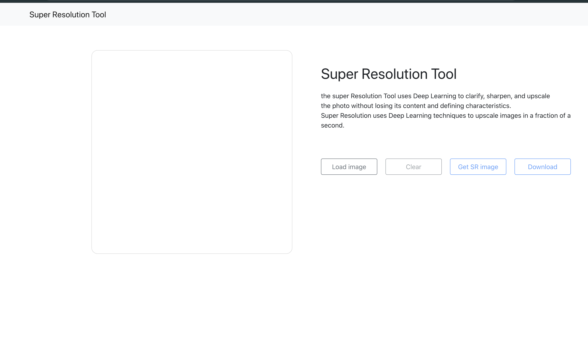
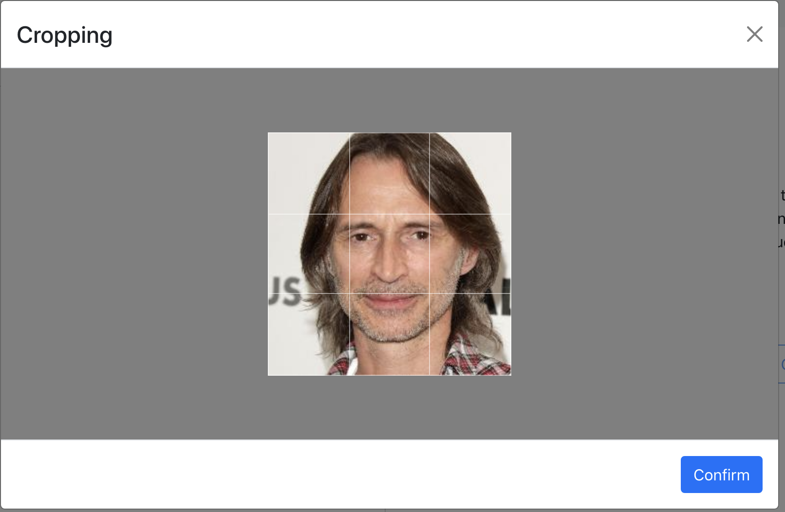
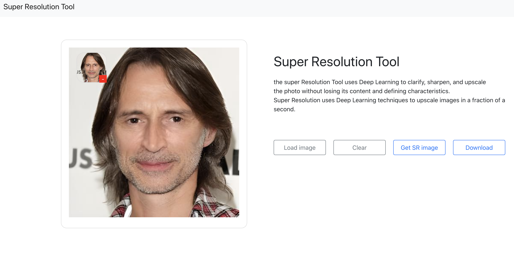

# 프로그래머스 데브코스 final project : 수리 (Su Re)


## Introduction
프로젝트 설명 + 어떤 기능을 수행하는지 등 적으면 될것같아요


## Requirements
OS : AWS Linux 2  
Docker : v20.10.7  
Docker-compose : v2.4.1  
Nvidia Driver : 470.103.01    
CUDA : v11.4


## Build & Run
package.json파일의 proxy주소를 docker-compose로 만든 컨테이너의 network 의 gateway로 변경  
- 주소 찾는 법 및 proxy 주소 설정  
`docker network ls` 컨테이너가 연결된 네트워크 ID 확인 (super resolution)  


`docker network inspect [Network ID]` 네트위크의 주소 확인  
```
"IPAM": {  
  "Driver": "default",  
    "Options": null,  
      "Config": [  
        {  
          "Subnet": "???.??.???.?",  
          "Gateway": "???.??.?.?"  <= 이부분을 check
        }  
     ]  
 },  
 ```
 
 `package.json` 파일의 proxy 주소를 위의 Gateway로 변경
 

`npm run build`  
패키지 파일 생성


`docker-compose --build -d`  
Docker 이미지 생성, 컨테이너 생성 + 빌드 + 실행  


## Example





## Result


